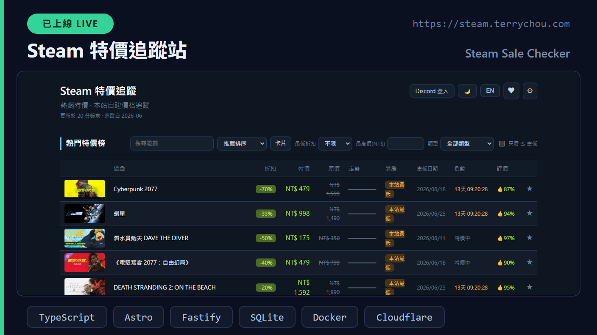
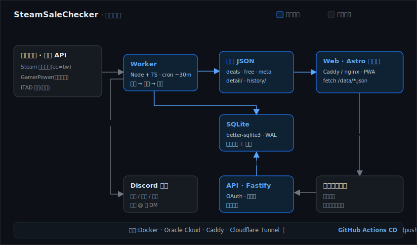
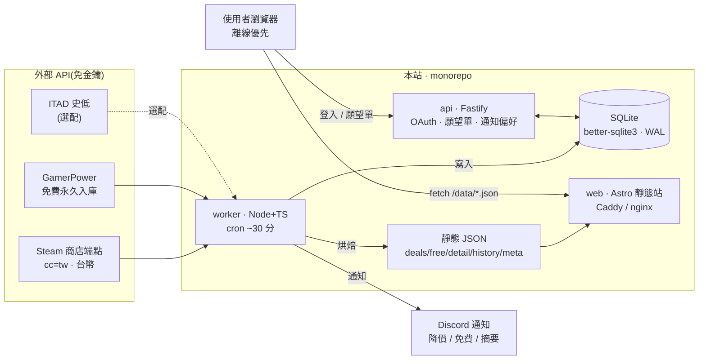

# Steam 特價站 · SteamSaleChecker

> 自架的 Steam 特價追蹤站 —— 後端每 ~30 分鐘抓 Steam 官方端點與 GamerPower、**自建價格歷史**(追蹤「開始監測以來的最低價」),烤成靜態 JSON;前端 Astro 暗色電競風,可選配 Discord 帳號、願望單與降價/免費/摘要通知。

<p align="center"></p>

[](https://github.com/q86865511/SteamSaleChecker/actions/workflows/deploy.yml)
[](https://steam.terrychou.com)
[](tsconfig.base.json)
[](web/package.json)
[](api/package.json)
[](worker/package.json)
[](api/package.json)
[](docker-compose.yml)
[](#-測試)
[](LICENSE)

<p align="center"></p>

> 後端每 ~30 分鐘抓 Steam 商店端點與 GamerPower → 寫進 SQLite 累積自己的台幣價格歷史 → 烤成一批靜態 JSON;前端 Astro 暗色電競風,以 SteamDB 風格的可排序熱門特價榜、即將結束、免費領取與單款詳情頁(價格走勢圖)呈現。可選擇性接上 Fastify API:Discord 登入、跨裝置願望單、每款目標價,並由 Discord Bot 派送降價/免費/摘要通知。

- 🧊 **自建價格歷史**:Steam 官方無歷史價,本站自記每次台幣價,誠實標示「追蹤以來最低」;可選配 ITAD 校正史低參考值
- ⚡ **靜態 JSON 架構**:worker 烤 JSON、前端 client 端 fetch,**資料更新免重新 build**;公開瀏覽永遠只讀靜態檔
- 🔔 **選配 Discord 帳號與通知**:離線優先,未登入也能用;登入後願望單跨裝置同步 + 降價/免費/摘要通知

**目前進度**:R5 批次已合併 `main` 並自動部署 live,**164 測試全綠**,正式站 **https://steam.terrychou.com**(Oracle Docker + Caddy + Cloudflare Tunnel)。逐次進度與決策見 [`PROGRESS.md`](PROGRESS.md)。

## 目錄

- [這是什麼](#這是什麼)
- [技術亮點](#-技術亮點)
- [架構](#-架構)
- [快速開始](#-快速開始)
- [測試](#-測試)
- [功能導覽](#功能導覽)
- [資料流程](#資料流程)
- [特色系統](#特色系統)
- [資料來源與規模](#資料來源與規模)
- [Discord 帳號與通知(選配)](#discord-帳號與通知選配)
- [環境變數](#環境變數)
- [部署](#部署)
- [專案結構](#專案結構)
- [擴充與開發](#擴充與開發)
- [已知限制](#-已知限制)
- [授權](#-授權)
- [文件索引](#文件索引)

## 這是什麼

一個自架的 **Steam 特價追蹤站**。後端每 ~30 分鐘抓取 Steam 官方商店端點與 GamerPower,自己累積每款遊戲的台幣價格歷史(因此能誠實計算「本站開始監測以來的最低價」),再把結果烘焙成一批靜態 JSON。前端是 **Astro** 暗色電競風,以 SteamDB 風格的可排序熱門特價榜、即將結束、免費領取與單款詳情頁(價格走勢圖)呈現。掛在個人網站子站,同時作為作品集。

技術上刻意走「**資料與前端解耦**」:worker 烤 JSON、前端 client 端 `fetch`,資料更新免重新 build;所有第三方 API 呼叫都在 server 端,公開瀏覽永遠只讀靜態檔,既快又穩。專案以 npm workspaces 切成 `shared` / `worker` / `web` / `api` 四個套件,核心邏輯以 TDD 撰寫(**164 測試**)。

帳號與通知是**選配且離線優先**:未登入時願望單存在瀏覽器 `localStorage`,完全不影響瀏覽。接上 Fastify API 後可用 Discord 登入、跨裝置同步願望單、為每款設**目標價**,並由 Discord Bot 派送降價、免費遊戲與每日/每週特價摘要通知(可選頻道 @你 或私訊 DM)。

## ✨ 技術亮點

- **自建價格歷史**:Steam 官方無歷史價,worker 每輪把台幣價寫進 SQLite 累積走勢並維護「觀測以來最低」;誠實標「追蹤以來最低」,可選配 ITAD 校正史低參考值而**不污染**走勢曲線。
- **靜態 JSON 架構**:worker 原子寫出 `deals`/`free`/`meta`/`detail`/`history` 等 JSON,前端 client 端 `fetch`,**資料更新免重新 build**;抓取失敗續供舊檔。
- **monorepo + 純函式 TDD**:`shared`(幣別/折扣、創新低判斷、Steam/GamerPower/ITAD 解析、sparkline…)皆為可測純函式;`worker` / `web` / `api` 共用型別,**164 測試**(vitest)。
- **SteamDB 風前端,零框架**:Astro 靜態輸出 + 少量 TS;可排序緊湊列表⇄卡片、單款搜尋、即時倒數、列內價格 sparkline、Steam 評價,深/淺主題(uPlot 圖表隨主題重繪)。
- **選配 Discord 子系統**:Fastify + secure-session 做 OAuth 登入,願望單跨裝置同步(`localStorage` → DB 合併);**per-user 通知偏好**(降價/免費/摘要/類型/頻道·DM)存 DB,worker 依偏好決定對誰、用什麼方式發。
- **冪等通知,不洗頻**:只對「跌破先前已記錄最低」的 meaningful new low 通知,首次觀測不發;已通知標記去重、失敗下輪重試。
- **免金鑰資料源**:Steam 商店端點與 GamerPower 皆免金鑰(台灣區 `cc=tw`、台幣);ITAD 史低校正與 Discord 通知皆為選配,未設定自動略過。
- **一鍵容器化部署**:`Dockerfile` + `docker-compose`(api + worker loop,SQLite volume);GitHub Actions push `main` → SSH 到 Oracle Cloud 自動 build/部署 + health check。

## 📐 架構

整體分兩條路徑:**公開靜態資料流**(完全唯讀、可獨立運作)與**選配的帳號/通知**(Discord 登入、願望單、通知)。worker 是唯一會對外抓取與寫入的程序;web 永遠只讀烤好的 JSON;api 與 worker 共用同一個 SQLite。頂部大圖為鳥瞰,下方 Mermaid 為資料流:



更細的設計脈絡見 [`PROGRESS.md`](PROGRESS.md) 的「重要決策紀錄」;部署細節見[部署](#部署)一節。

## 🚀 快速開始

需求:**Node 20+**。

```bash
npm install                            # 安裝所有 workspace 相依

# 1) 後端:抓資料 + 烤出 web/public/data/*.json(SSC_DEAL_LIMIT 控制榜長度)
SSC_DEAL_LIMIT=40 npm -w @ssc/worker run run

# 2) 前端:本機開發(http://localhost:4321)
npm -w @ssc/web run dev
#    或產出靜態檔到 web/dist(交給 nginx / Caddy)
npm -w @ssc/web run build

# 3)(選配)帳號 / 願望單 API —— 需先建 api/.env(見「環境變數」)
npm -w @ssc/api run dev                # http://localhost:8787
```

只跑公開站不需要 `api/.env` 或任何金鑰;Discord 帳號、通知與 ITAD 史低校正都是選配。

## 🧪 測試

以 vitest 跑 `shared / worker / api` 的單元測試(核心邏輯皆純函式 TDD):

```bash
npm test            # vitest run —— 目前 164 測試
npm run test:watch  # watch 模式
```

> 前端為 Astro + 少量 TS,主要以**重載 + 瀏覽器實測**驗證(Preview 工具 snapshot / inspect / eval);無 headless 前端自動化測試,CI 也只負責部署(見[已知限制](#-已知限制))。

## 功能導覽

| 頁面 | 路由 | 內容 |
| --- | --- | --- |
| 首頁 · 熱門特價榜 | `/` | SteamDB 風可排序列表⇄卡片、單款搜尋、折扣/價格/類型/「≤史低」篩選、即時倒數、列內 sparkline、Steam 評價;另含「即將結束」與「免費領取」兩區 |
| 商品詳細頁 | `/game?appid=` | 價格走勢圖(本站自建歷史)、本站最低、Steam 評價、介紹/類型/上市日/截圖、一鍵前往 Steam、設目標價 |
| 收藏 / 願望單 | `/favorites` | 集中顯示收藏(含目前沒特價的)、現價/史低、快速移除;一鍵從公開 Steam 願望單匯入(貼 SteamID64 或 `/profiles/` 網址,免金鑰) |
| 設定 | `/settings` | 主題(跟隨系統/深/淺)、語言(繁中/英)、預設檢視;登入後的通知偏好(降價/免費/摘要/類型/頻道·DM·自己的伺服器),含邀請機器人到自己伺服器並選頻道/分流/提及 |

操作:列表欄位點擊排序;遊戲名稱為連結(鍵盤可達);★ 收藏未登入存 `localStorage`、登入後合併進 DB。

## 資料流程

1. **抓取** —— worker 每 ~30 分(`SSC_INTERVAL`,預設 1800s)向 Steam 特價搜尋(`infinite=1&filter=topsellers`)分頁取 appid,再 `appdetails` 補台幣價/封面/類型/截圖、`appreviews` 取評價摘要;GamerPower 取永久入庫免費遊戲。所有呼叫節流(~1 req/s + 退避)以尊重 Steam per-IP 限制。
2. **寫入** —— 把每款台幣價寫進 SQLite `price_history` 累積走勢,維護 `game_stats` 的「觀測以來最低」;選配以 ITAD 校正史低參考值(gated by `ITAD_API_KEY`,每日刷新,**不**補歷史點)。
3. **烘焙** —— 原子寫出 `deals.json` / `free.json` / `meta.json` / `detail/{appid}.json` / `history/{appid}.json` / `games-index.json`;失敗則續供舊檔。
4. **呈現** —— Astro 靜態站 client 端 `fetch /data/*.json` 渲染,資料更新免重新 build。
5. **通知(選配)** —— 對「收藏且跌破先前最低(或設定的目標價)」的遊戲、新出現的免費遊戲、與每日/每週摘要,由 Discord Bot 依 per-user 偏好送到頻道 @你 或私訊 DM,皆為 **Steam 商店風 rich embed**(封面/原價→特價/評價/領取倒數/前往按鈕)。

## 特色系統

### 特價與價格追蹤
- 熱門特價榜(SteamDB 風):緊湊**可排序列表**(折扣/特價/原價)⇄**卡片**切換、**單款搜尋**、篩選(最低折扣/最高價/只看 ≤ 史低/**類型**)。
- 每款顯示折扣、現價/原價、「本站最低」狀態 + **史低日期**、**特價即時倒數**、**列內價格 sparkline**(降綠/升紅)與 **Steam 評價**(正評%,hover 顯示評語)。
- 「即將結束」獨立成區;商品詳細頁有完整價格走勢圖(uPlot,主題感知)。

### 免費遊戲
- 來自 GamerPower(僅收平台含 **Steam**、且「領了就永久擁有」者),附領取期限與 giveaway 價值。
- 站內保留可點擊連結回 GamerPower.com(來源歸屬)。

### 願望單與通知
- Discord 登入 → DB-backed 願望單,跨裝置同步(未登入 `localStorage`、登入後合併)。
- 每款可設**目標價**,跌破才通知(設了目標就只看目標)。
- **個人化通知偏好**:降價 / 免費 / 每日·每週摘要訂閱、**只接收特定類型**、通知**送共用頻道 @你 / 私訊 DM / 自己的伺服器**;摘要頻率 per-user,不必改 env。
- **邀請機器人到自己的伺服器**:在 `/settings` 一鍵以 OAuth 邀請機器人進你**自己管理**的伺服器,自動列出文字頻道下拉選一個;頻道路由預設統一,可切「分流」讓降價/免費/摘要各送不同頻道;提及方式可選 不提及 / @你 / @某身分組;附連線狀態、發送測試通知、移除連線。安全:邀請 callback 的 `guild_id` 可偽造,後端以 `scope=bot guilds`+換 code+`/users/@me/guilds` 驗證你**真有該伺服器管理權**才登記,寫入路由前再用 bot token 驗證頻道/身分組歸屬。
- 通知為 **Steam 商店風 rich embed**(彩色邊條、封面圖、`折扣/原價→特價`、Steam 評價、Discord 在地化領取倒數 `<t:>`、前往領取/商店 link button)。免費遊戲以 Steam `storesearch` 解出 appid 補評價·原價封面(對不到或非 Steam 來源自動退精簡版,仍含平台/價值/期限)。
- 一鍵從公開 **Steam 願望單匯入**(貼 SteamID64 或 `/profiles/` 網址,免金鑰)。

### 體驗與品質
- 繁中/英 i18n、深/淺色主題(跟隨系統、可手動切、持久)、預設檢視持久。
- PWA(favicon / manifest / OG 分享預覽)、資料新鮮度標示、About 技術說明段、來源歸屬。
- bot 上線顯示「Watching Steam 特價」狀態。

## 資料來源與規模

| 項目 | 說明 |
| --- | --- |
| Steam 商店端點 | `featuredcategories` / `appdetails` / 特價搜尋 / `appreviews`,**免金鑰**,台灣區 `cc=tw`(台幣) |
| GamerPower API | 永久入庫免費遊戲 / DLC,**免金鑰** |
| ITAD(IsThereAnyDeal) | 史低參考值校正,**選配**(需 `ITAD_API_KEY`) |
| 特價榜上限 | `SSC_DEAL_LIMIT`,預設 **120**(熱銷排序) |
| 價格歷史保留 | `SSC_HISTORY_KEEP_DAYS`,預設 **365** 天 |
| 抓取間隔 | `SSC_INTERVAL`,預設 **1800s**(~30 分) |
| 測試 | **164** 通過(vitest) |
| 套件 | 4 個 workspace:`shared` / `worker` / `web` / `api` |

> 「歷史最低」為**本站自建追蹤**(非 SteamDB / ITAD runtime),誠實標示「追蹤以來最低」;ITAD 僅用於校正史低參考值。本站與 Valve 無任何關係。

## Discord 帳號與通知(選配)

公開站完全不需要這段。要啟用登入、願望單同步與通知,複製 `api/.env.example` 為 `api/.env`(已 gitignore,**切勿提交**)並填:

1. **登入**:`DISCORD_CLIENT_ID` / `DISCORD_CLIENT_SECRET`(Discord Developer Portal)、`SESSION_SECRET`(≥32 字隨機)。OAuth2 → Redirects 加 `http://localhost:8787/auth/callback`(上線再加正式網域)。
2. **通知(降價/免費/摘要)**:另填 `DISCORD_BOT_TOKEN`、`DISCORD_GUILD_ID`、`DISCORD_NOTIFY_CHANNEL_ID`。Bot 以 `bot` scope + **View Channels / Send Messages / Create Instant Invite**(權限整數 3073)邀進伺服器,無需 privileged intents。worker 會載入 `api/.env`,對「收藏且創本站新低」的遊戲在頻道 @ 提醒;登入時以 `guilds.join` 自動把使用者加進伺服器。
3. **讓使用者邀請機器人進自己的伺服器(per-user 路由)**:填 `DISCORD_BOT_INVITE_REDIRECT_URI`(預設 `http://localhost:8787/api/bot/invite/callback`,上線換正式網域);並在 Discord 開發者後台 **① Bot → Public Bot 設為 ON**(非擁有者才能邀請)、**② OAuth2 → Redirects 註冊上述回跳網址**(沒註冊就不會回跳帶 `guild_id`)。安裝權限整數 19456(View Channel + Send Messages + Embed Links),列頻道/身分組是 REST,無需 privileged intents。
4. **摘要**:`SSC_DIGEST_HOURS`(0=停用、24=每日、168=每週);需 bot token + notify channel。使用者也可在 `/settings` 自選摘要頻率(per-user,不必改 env)。

### ITAD 史低校正(選配)

冷啟動時「史低」只是第一次觀測值。設定 [IsThereAnyDeal](https://isthereanydeal.com/apps/) 的 **API Key**(`ITAD_API_KEY`,**不是** OAuth Client Secret)即可用真實 Steam 史低(台灣區 / 台幣)校正 —— 只更新 `game_stats` 的史低欄位,**不會**往 `price_history` 補歷史點。

```bash
npm -w @ssc/worker run run             # 0) 先跑一次讓 game_stats 有資料
npm -w @ssc/worker run seed -- --check # 1) 只查不寫,驗證 country=TW 回 TWD
npm -w @ssc/worker run seed            # 2) 實際寫入(idempotent,可重跑)
npm -w @ssc/worker run run             # 3) 重烤 JSON 反映新史低
```

有 key 後 worker 每 `SSC_ITAD_REFRESH_HOURS`(預設 24h)自動刷新,失敗不影響主流程。

## 環境變數

worker 與 api 共用同一份 `api/.env`(docker-compose 以 `env_file` 帶入)。完整範本見 [`api/.env.example`](api/.env.example)。

**worker / 資料管線**

| 變數 | 預設 | 說明 |
| --- | --- | --- |
| `SSC_DATA_DIR` | `web/public/data` | 烤出的 JSON 目錄 |
| `SSC_DB` | `data/steam.db` | SQLite 檔路徑(worker 與 api 共用) |
| `SSC_DEAL_LIMIT` | `120` | 特價榜抓取上限(熱銷排序) |
| `SSC_HISTORY_KEEP_DAYS` | `365` | `price_history` 保留天數(0=不修剪;史低存 `game_stats` 不受影響) |
| `SSC_INTERVAL` | `1800` | docker-compose worker loop 間隔(秒) |
| `ITAD_API_KEY` | —— | ITAD 史低刷新金鑰(API Key,非 OAuth secret);未設則略過 |
| `SSC_ITAD_REFRESH_HOURS` | `24` | ITAD 自動刷新間隔(小時) |
| `SSC_DIGEST_HOURS` | `0` | 特價摘要間隔:0=停用、24=每日、168=每週 |

**api / 帳號 · 通知**

| 變數 | 預設 | 說明 |
| --- | --- | --- |
| `DISCORD_CLIENT_ID` / `DISCORD_CLIENT_SECRET` | —— | Discord OAuth 應用憑證 |
| `SESSION_SECRET` | —— | secure-session 簽章祕密(≥32 字) |
| `DISCORD_REDIRECT_URI` | `http://localhost:8787/auth/callback` | 登入 OAuth callback;上線換正式網域 |
| `DISCORD_BOT_INVITE_REDIRECT_URI` | `http://localhost:8787/api/bot/invite/callback` | **選配**;「邀請機器人到自己伺服器」回跳網址(須在 Discord 後台另註冊;Bot 須設 Public) |
| `WEB_ORIGIN` | `http://localhost:4321` | 前端來源(CORS) |
| `API_PORT` | `8787` | API 埠(prod 用 `8788`) |
| `DISCORD_BOT_TOKEN` | —— | Bot token(通知必填) |
| `DISCORD_GUILD_ID` | —— | 伺服器 ID(通知必填) |
| `DISCORD_NOTIFY_CHANNEL_ID` | —— | 通知頻道 ID |
| `SSC_STEAM_ICON_URL` | —— | **選配**;通知 embed 作者/footer 的 Steam 小圖示 URL,未設則只顯示文字 |
| `COOKIE_SECURE` | `false` | 線上(https)設 `true` |
| `SSC_RATE_LIMIT_MAX` | `100` | API 每 IP 每分鐘請求上限(超量回 429);反向代理後需 `trustProxy`(已內建)才能正確分桶 |

## 部署

正式站以 Docker 跑在 **Oracle Cloud** VM,前端靜態檔由 **Caddy** 服務、經 **Cloudflare Tunnel** 對外;**GitHub Actions** 在 push `main` 時自動部署。

```bash
# 主機上(或本機 build 後):
npm ci
npm -w @ssc/web run build              # 產出 web/dist 靜態檔
docker compose up -d --build           # api(:8788)+ worker loop(SQLite volume)
```

- [`docker-compose.yml`](docker-compose.yml):`api` 容器(`127.0.0.1:8788`,`COOKIE_SECURE=true`)+ `worker` 容器(`while true; run; sleep ${SSC_INTERVAL:-1800}`),共用 `sscdata` volume;worker 把 JSON 烤到 bind mount `/srv/steam/data`。
- CI/CD:[`.github/workflows/deploy.yml`](.github/workflows/deploy.yml)—— push `main` 先跑 `test` job(GitHub runner:`npm ci` → `npm test`),**測試綠才部署**;`deploy` job(`appleboy/ssh-action`)SSH 到 VM → `git reset --hard` → `npm ci` → build web → `rsync` 靜態檔到 `/srv/steam`(`--exclude data`)→ `docker compose up -d --build` → `curl /health` 健康檢查(最多 15 次)。
- secrets:`OCI_HOST` / `OCI_USER` / `OCI_SSH_KEY`;祕密(Discord / ITAD)放主機 `api/.env`(gitignore,`git reset` 不覆蓋)。

## 專案結構

```
SteamSaleChecker/
├─ shared/          @ssc/shared —— 純函式 + 型別(無相依,TDD)
│  └─ src/          price · lowtracker · spark · steam-parse · gamerpower-parse · steam-wishlist · types
├─ worker/          @ssc/worker —— 抓取 / SQLite / 烤 JSON / 通知(tsx CLI)
│  └─ src/          index(編排) · pipeline · db · bake · notify · giveaways · digest
│     ├─ sources/   steam · gamerpower
│     └─ seed/      itad-seed(CLI) · itad · itad-parse
├─ web/             @ssc/web —— Astro 靜態站
│  ├─ src/pages/    index · game · favorites · settings
│  ├─ src/scripts/  view · chart(uPlot) · i18n · theme · wishlist · notif …(純邏輯 TDD)
│  └─ public/data/  ← worker 烤出的 JSON(deals / free / meta / detail / history)
├─ api/             @ssc/api —— Fastify(OAuth · 願望單 · 通知偏好 · bot presence)
│  └─ .env.example  Discord / session / ITAD 設定範本
├─ docs/            architecture.svg(本圖)· superpowers(規劃文件)
├─ Dockerfile       node:22-slim(better-sqlite3 相容,附 build tools 後備)
├─ docker-compose.yml
└─ .github/workflows/deploy.yml
```

## 擴充與開發

- **核心邏輯走純函式 + TDD**:幣別/折扣、創新低判斷、解析器、sparkline 等都在 [`shared/`](shared/),先寫測試再實作。
- **新增資料源**:在 `worker/src/sources/` 加一支抓取 + 對應 `*-parse.ts` 純函式(TDD),於 `pipeline.ts` 接線、寫進 SQLite,再於 `bake.ts` 烤進 JSON;前端加對應 fetch / 渲染即可。
- **型別單一來源**:共用型別(`Deal`、`FreeGiveaway` 等)定義在 `shared/src/types.ts`,worker / web / api 一致引用。
- **跑驗證**:`npm test`(164);前端改動以 `npm -w @ssc/web run dev` 重載 + Preview 實測。

## 🚧 已知限制

- **靜態站 → 無 per-game OG**:詳細頁走「靜態 + query param client fetch」,與 per-game OG 分享不相容,故沿用站台通用 OG(client 端僅改 `document.title`)。
- **CI 測試門檻僅含單元測試,前端仍手測**:`deploy.yml` 的 `test` job 會在部署前跑 `npm test`(`shared`/`worker`/`api` 單元),失敗即擋部署;但前端(Astro 頁面/DOM 邏輯)仍以瀏覽器實測,無 headless 自動化。README 徽章中的 tests 數為**靜態**標示。
- **通知需自備 Discord 資產**:降價/免費/摘要通知需使用者自己的 bot token / guild / channel;未設定則自動略過(公開站不受影響)。
- **史低為「追蹤以來」**:Steam 官方無歷史價,冷啟動時史低 = 首次觀測;ITAD 校正為選配(需 API Key),且只校正參考值、不補走勢歷史點。
- **Steam 端點節流**:未公開端點有 per-IP 限制(~200 req/5min);`appdetails` / `appreviews` 已節流 ~1 req/s + 退避。

## 📄 授權

本專案以 **MIT License** 釋出,詳見 [`LICENSE`](LICENSE)。

> 資料來自 Steam 與 GamerPower 等第三方服務,其內容/商標屬各自所有者;本站與 Valve 無任何關係,僅作個人作品集與學習用途。

## 文件索引

| 文件 | 內容 |
| --- | --- |
| [`PROGRESS.md`](PROGRESS.md) | 進度與**重要決策紀錄**(技術選型的 why) |
| [`docs/architecture.svg`](docs/architecture.svg) | 系統架構鳥瞰圖(本 README 置頂) |
| [`api/.env.example`](api/.env.example) | Discord / session / ITAD 設定範本 |
| [`docker-compose.yml`](docker-compose.yml) | api + worker 容器編排 |
| [`.github/workflows/deploy.yml`](.github/workflows/deploy.yml) | GitHub Actions 自動部署 |
